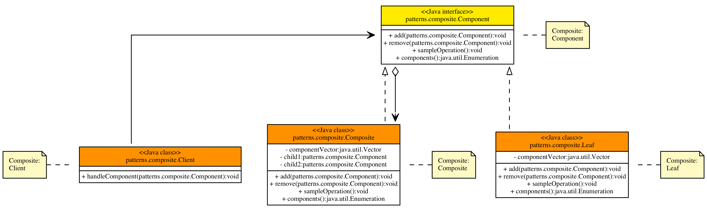

MagicUML - A UML Diagram Generator for Java
===========================================

This program automatically generates UML class diagrams given a list of Java
classes.

The code is in package `uml`.

Some example Design Patterns are in package `patterns`.

The GUI main function resides in class `uml.UmlDiagramGeneratorGui`.

## Sample UML Diagrams Generated using MagicUML

**Observer Pattern**

**Composite Pattern**

**Decorator Pattern**

**State Pattern**

**Builder Pattern**

## Dependencies

- GraphViz (http://www.graphviz.org/)

  GraphViz is used for rendering DOT graph and generating the final image.

  The UML Diagram Generator will find the `dot` binary through a Java System
  property named `uml.graphviz.dot`. If the property does not exist, it will
  try to find the dot binary at `/opt/local/bin/dot`.

- (optional) JUnit (http://junit.org/)

- (optional) Maven (https://maven.apache.org/)

  A Maven project file is included in `pom.xml`.

